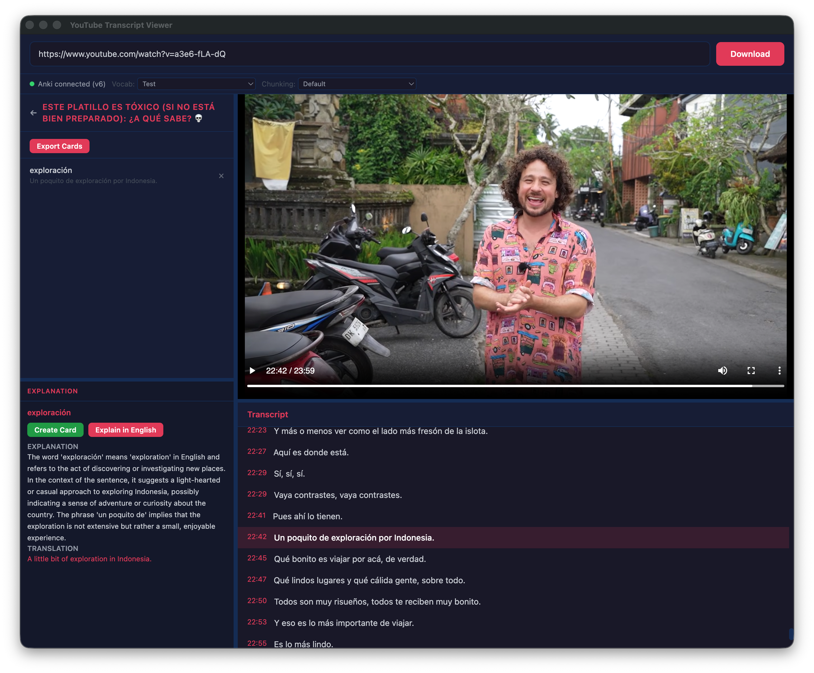

# YouTube Spanish Transcript Viewer

A desktop app for learning Spanish from YouTube videos. Download a video, get an automatic transcription, select phrases to get AI explanations, and export flashcards directly to Anki — complete with audio clips and screenshots.



## Features

- **Download & Transcribe** — Paste a YouTube URL, download the video, and get automatic Spanish subtitles via MLX Whisper (Apple Silicon optimized)
- **Interactive Transcript** — Synced, clickable transcript that highlights as the video plays
- **AI Explanations** — Select any Spanish phrase to get an explanation and translation powered by OpenAI
- **Anki Card Creation** — One-click card creation capturing the phrase, sentence, context, explanation, and translation
- **Media Export** — Cards exported to Anki include extracted audio clips and video screenshots
- **Dual Deck Support** — Choose separate Anki decks for vocabulary cards and chunking cards
- **Resizable Panels** — Drag-to-resize video, sidebar, and explanation panels

## Prerequisites

- **macOS** (Apple Silicon recommended for MLX Whisper)
- **Node.js** 18+
- **Python** 3.9+
- **Anki** with [AnkiConnect](https://ankiweb.net/shared/info/2055492159) plugin installed
- **yt-dlp** and **FFmpeg**:
  ```bash
  brew install yt-dlp ffmpeg
  ```
- **Python packages**:
  ```bash
  pip install mlx-whisper genanki
  ```

## Setup

1. Clone the repo and install dependencies:
   ```bash
   git clone https://github.com/kevinmonisit/MWE-Anki-Generator.git
   cd MWE-Anki-Generator
   npm install
   ```

2. Create a `.env.local` file in the project root with your OpenAI API key:
   ```
   OPENAI_API_KEY=sk-proj-your-key-here
   ```

3. Build and run:
   ```bash
   npm start
   ```

## Usage

1. Paste a YouTube URL and click **Download** — the app downloads the video and transcribes it
2. Watch the video with the synced transcript panel
3. Select any Spanish text and click **Explain** to get an AI explanation and translation
4. Click **Create Card** to save a flashcard
5. Choose your target Anki deck from the dropdown and click **Export Cards** to send them to Anki with audio and screenshots

## Project Structure

```
├── main.ts              # Electron main process (IPC, Anki export, FFmpeg)
├── renderer.ts          # UI logic (video player, transcript, cards)
├── preload.ts           # IPC bridge between main and renderer
├── index.html           # App layout
├── src/input.css        # Tailwind source CSS
├── scripts/
│   ├── download.py      # YouTube download + Whisper transcription
│   ├── transcribe.py    # Standalone transcription
│   ├── make_subs2srs.py # Legacy subs2srs deck generator
│   ├── build_custom_deck.py  # Custom APKG builder
│   └── make_apkg.py     # APKG from TSV
├── dist/                # Compiled output (generated)
├── tsconfig.json
├── tailwind.config.js
└── package.json
```

## Tech Stack

- **Electron** + **TypeScript** — Desktop app framework
- **Tailwind CSS** — Styling
- **MLX Whisper** — On-device Spanish transcription (Apple Silicon)
- **OpenAI API** (gpt-4o-mini) — Phrase explanation and translation
- **AnkiConnect** — Local HTTP API for Anki integration
- **yt-dlp** — YouTube downloading
- **FFmpeg** — Audio/screenshot extraction for flashcards

## Data Storage

All app data is stored locally in the Electron userData directory (`~/Library/Application Support/youtube-transcript-viewer/`):

- `downloads/` — Downloaded videos, audio, and transcripts
- `settings/user-settings.json` — Selected Anki decks

Cards are stored in the browser's localStorage per video.

## Scripts

| Script | Description |
|--------|-------------|
| `npm start` | Build and launch the app |
| `npm run build` | Compile TypeScript and Tailwind CSS |
| `npm run css` | Rebuild CSS only |

## License

ISC
